# MeshBot: Asistente para Meshtastic

MeshBot es un nodo virtual avanzado y personalizable para la red Meshtastic. Se conecta a un bróker MQTT para escuchar el tráfico de la red, recopilar datos de telemetría de los nodos y responder a los usuarios utilizando la inteligencia artificial de Google Gemini.

```mermaid
flowchart LR
    subgraph RED LORA
        direction TB
        RU["📻<br>Radio Usuario"]
        RM["💬<br>Radios (Mensajería)"]
        RT["🛰️<br>Radios (Telemetría)"]
    end

    subgraph LORA - MQTT
        direction TB
        G2["📡<br>Gateway 2"]
        G1["📡<br>Gateway 1"]
    end

    subgraph RED LOCAL / CLOUD
        direction TB
        MB["🤖<br>Nodo Virtual<br>(MeshBot)"]
        M["🌐<br>Broker MQTT<br>(Topics)"]
        IA["🧠<br>LLM (GPU)<br>(ChatBot)"]
    end

    subgraph SERVICIOS API
        CLI["☁️<br>Climatología"]
        GEO["🗺️<br>Cartografía"]
        BD["🗄️<br>Base de Datos"]
        AD["📈<br>Análisis de Datos"]
        N["🔔<br>Notificaciones"]
    end

    %% Flujo de Entrada
    RM -- "Mensaje" --> G2
    RT -- "Datos" --> G2
    RU -- "Mensaje" --> G1
    G1 --> M
    G2 --> M
    %% Flujo Interno y Procesamiento
    M <-->|Respuesta| MB
    MB <-->|Consulta / Respuesta| IA
    %% Flujo Externo y Datos
    IA <-->|Consulta / Respuesta| CLI
    IA <-->|Consulta / Respuesta| GEO
    IA <-->|Consulta / Respuesta| BD
    IA <-->|Consulta / Respuesta| AD
    IA <-->|Consulta / Respuesta| N
    %% Flujo de Salida
    M -- "Respuesta" --> G1
    G1 -- "Respuesta" --> RU
```



## ✨ Características Principales

* **Inteligencia Artificial Conversacional**: Utiliza Google Gemini para mantener conversaciones fluidas, responder preguntas y entender el contexto.
* **Soporte Multi-Canal**: Escucha y procesa datos de un canal primario (telemetría) y uno secundario (interacción).
* **Recopilación de Telemetría**: Guarda en una base de datos la información de los nodos (posición, batería, etc.).
* **Herramientas de IA**: Puede consultar el tiempo, la hora o los datos de cualquier nodo de la red.
* **Sistema de Comandos**: Incluye comandos rápidos con prefijo `!` para acciones directas.

---

## ⚠️ ¡Aviso Importante!

**Utiliza este código con precaución.**

Este es un software **experimental**. Ha sido desarrollado con fines de aprendizaje y como una herramienta para la comunidad. El autor no se hace responsable de posibles problemas derivados de su uso, como un comportamiento inesperado del bot, pérdida de datos o cualquier mal funcionamiento en tu red Meshtastic.

**Úsalo bajo tu propio riesgo.**

---

## 🚀 Instalación

#### 1. Prerrequisitos

* Python 3.9 o superior.
* Acceso a un bróker MQTT conectado a tu red Meshtastic.

#### 2. Clonar y Preparar el Entorno

```bash
git clone https://github.com/lhupyn/meshbot.git
cd meshbot
python3 -m venv venv
source venv/bin/activate  # En macOS/Linux
# .\\venv\\Scripts\\activate  # En Windows
```

#### 3. Instalar Dependencias

```bash
pip install -r requirements.txt
```

---

## 🛠️ Configuración

La configuración del bot se gestiona a través de un único archivo. Sigue estos pasos con atención.

### Paso 1: Renombrar el archivo de configuración

**Renombra `config.py.example.py` a `config.py`**. Este paso es fundamental.

### Paso 2: Editar `config.py`

Abre tu nuevo archivo `config.py` y ajusta los parámetros según tus necesidades.

* **`DATABASE_FILE`**: Nombre del archivo de la base de datos.
* **`NODE_DB_CLEANUP_DAYS`**: Días de inactividad para eliminar un nodo de la BD.
* **`BROADCAST_ENABLED`**: `True` para activar anuncios periódicos.
* **`BROADCAST_INTERVAL_MINUTES`**: Intervalo en minutos para los anuncios.
* **`BROADCAST_MESSAGE`**: Mensaje del anuncio.
* **`PRESENCE_ENABLED`**: `True` para que el bot anuncie su presencia.
* **`PRESENCE_INTERVAL_MINUTES`**: Intervalo para los anuncios de presencia.
* **`POSITION_ENABLED`**: `True` para que el bot anuncie su ubicación.
* **`BOT_LATITUDE`, `BOT_LONGITUDE`, `BOT_ALTITUDE`**: Coordenadas del bot.
* **`MQTT_BROKER`, `MQTT_PORT`, `MQTT_USERNAME`, `MQTT_PASSWORD`**: Datos de tu bróker MQTT.
* **`ROOT_TOPIC`**: Topic raíz de tu región (ej. `'msh/EU_868'`).
* **`PRIMARY_CHANNEL_NAME`**, **`PRIMARY_CHANNEL_KEY_B64`**: Canal principal y su clave.
* **`SECONDARY_CHANNEL_NAME`**, **`SECONDARY_CHANNEL_KEY_B64`**: Canal de interacción y su clave.
* **`OUR_NODE_NUMBER`**: **¡MUY IMPORTANTE!** El ID de tu bot en formato hexadecimal (ej. `0xDEADBEEF`).
* **`OUR_LONG_NAME`**, **`OUR_SHORT_NAME`**: Nombres del bot.
* **`GEMINI_API_KEY`**, **`WEATHER_API_KEY`**: **¡REQUERIDAS!** Tus claves de API para Gemini y OpenWeatherMap.

---

## ▶️ Uso

Una vez configurado, inicia el bot desde tu terminal:

```bash
python3 meshbot.py
```

Para detenerlo, pulsa `Ctrl + C`.

### Interactuar con el Bot

* **Mensaje Directo (DM)**: Envía un mensaje privado al bot para conversar con la IA.
* **Mención Pública**: En el canal secundario, escribe `@meshbot` seguido de tu pregunta.
* **Comandos**: Usa el prefijo `!` para acciones rápidas (ej. `!tiempo Madrid`).

---

## 🏆 Agradecimientos

Este proyecto no habría sido posible sin el increíble trabajo de la comunidad y los proyectos de código abierto que lo sustentan. Nuestro más sincero agradecimiento a:

* **Concepto Original:** [`MQTT Connect for Meshtastic`](https://github.com/pdxlocations/connect) by `pdxlocations`.


---
*Creado con ❤️ por LhUpYn y Gemini.*
*Encuentra este proyecto en [GitHub](https://github.com/lhupyn/meshbot).*
